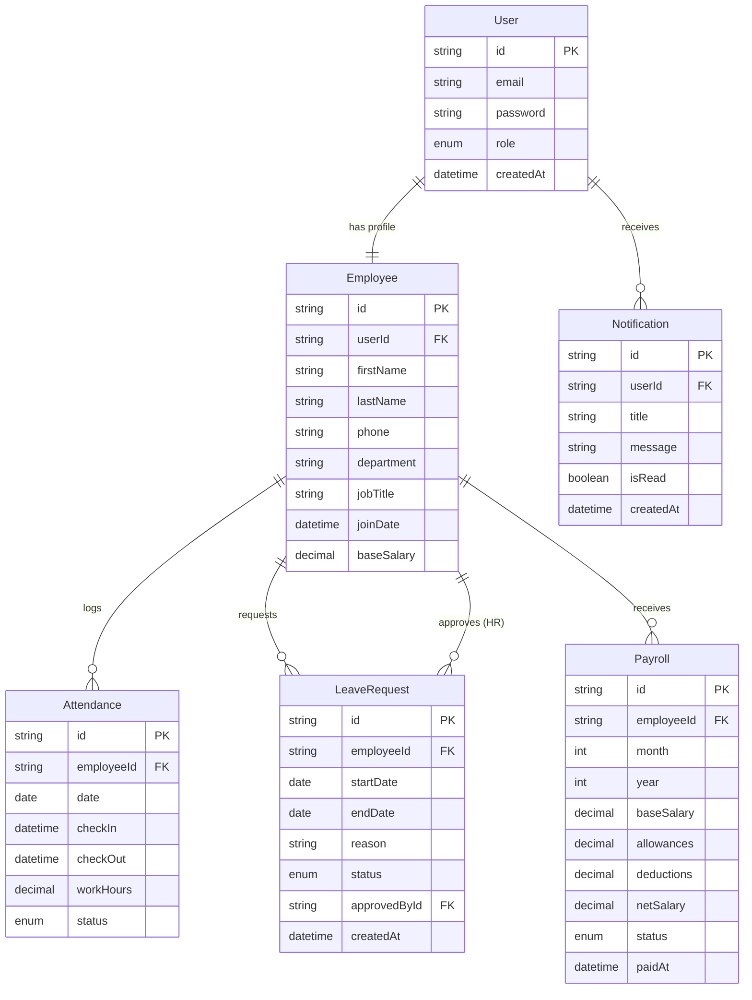
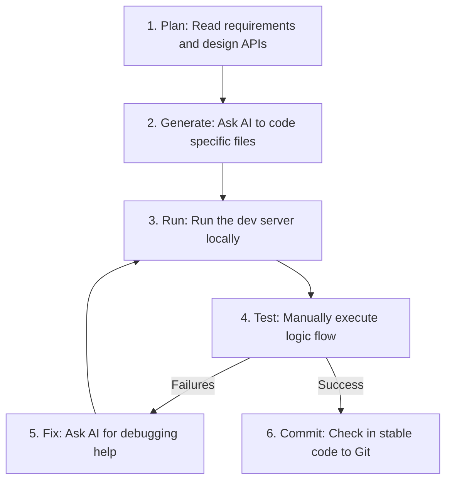

# Dayflow HRMS — Implementation Plan

This document outlines the system architecture, technology stack, database schema, page hierarchy, API endpoints, development roadmap, and workflow guidelines for building **Dayflow — Human Resource Management System (HRMS)**. It is structured to help a beginner-level team build a clean, secure, and maintainable MVP.

---

## User Review Required

> [!IMPORTANT]
> The primary technology stack recommended is **Vite + React (with Vanilla CSS) + Node.js (Express) + Prisma ORM (SQLite)**. This is chosen to minimize local setup friction (SQLite is a single file and does not require installing/configuring database engines) while still maintaining a robust, real-world development pattern.
>
> Please review the **To Be Decided** items below to ensure alignment with project expectations before we start development.

---

## 1. Project Overview

Dayflow is a web-based Human Resource Management System (HRMS) designed to streamline day-to-day HR operations.
The application supports two roles: **Employee** and **HR/Admin**.
- **Employees** can check in/out, log attendance, request time off, view their own profile, and see their payroll information.
- **HR/Admins** can manage employee profiles, monitor organization-wide attendance, approve or reject leave requests, and control payroll settings.

The goal is to deliver a functional, high-quality Minimum Viable Product (MVP) using clean monolithic architecture, ensuring the codebase remains easy to understand, debug, and test for beginner developers.

---

## 2. Assumptions & "To Be Decided" (TBD) Items

The following requirements are either unspecified or marked for future consideration. We will implement basic placeholders/structures in the MVP to accommodate them:

| Requirement Area | MVP Assumption / Placeholder | Future Target / TBD |
| :--- | :--- | :--- |
| **Leave Allocation & Accrual** | Employees get a flat 15 days of annual leave per year, simple deduction. | Accrual rules (e.g., 1.25 days/month), carryover policies, and distinct leave types (Sick, Casual, Maternity). |
| **Check-in Constraints** | Simple click-to-register timestamp. No verification. | Geofencing, IP restrictions, or camera snapshots. |
| **Payroll Calculations** | Flat monthly base salary. Tax deductions, bonuses, and overtime are calculated manually or entered by Admin. | Automated tax integration, variable hourly wage calculations, and benefits management. |
| **Document Uploads** | Profile photo upload using local base64/static directory storage. | PDF contract uploads, cloud storage integration (AWS S3 / Supabase Storage). |
| **Notification Delivery** | In-app notification list only. | Email notifications (via SendGrid/Nodemailer) or SMS alerts. |

---

## 3. Recommended Technology Stack

We recommend a **Single-Repo Monolith** architecture with frontend and backend in separate folders.

```
dayflow-hrms/
├── frontend/   # Vite + React SPA
└── backend/    # Node.js + Express + Prisma (SQLite)
```

### Primary Stack (Recommended)
* **Frontend**: React (via Vite) + Vanilla CSS.
  - *Why*: Vite provides lightning-fast builds. React offers component reusability. Vanilla CSS ensures developers learn CSS fundamentals rather than framework-specific classes, maintaining maximum styling control.
  - *Advantages*: Highly standard, massive online community, excellent developer tools.
* **Backend**: Node.js + Express.js.
  - *Why*: JavaScript on both frontend and backend reduces cognitive load for beginners. Express is lightweight and simple.
  - *Advantages*: Easy routing, middleware model is easy to grasp.
* **Database & ORM**: SQLite + Prisma ORM.
  - *Why*: SQLite stores data in a local file (`dev.db`). No installation of PostgreSQL/MySQL is needed, meaning "clone and run" works instantly. Prisma provides type safety and a graphical UI (`npx prisma studio`) to explore data.
  - *Advantages*: Extremely low setup overhead. If moving to production, Prisma allows switching from SQLite to PostgreSQL with a 1-line configuration change.
* **Authentication**: JSON Web Tokens (JWT) stored in HTTP-only Cookies or Local Storage.

### Alternatives Considered
1. **Next.js (React Full-Stack Framework)**
   - *Pros*: Unified codebase, server-side rendering, built-in API routes.
   - *Cons*: Next.js App Router caching rules and Server Component vs. Client Component split can be confusing for absolute beginners.
2. **Express + EJS (Server-Side Templates)**
   - *Pros*: No SPA routing required, simple state handling, no frontend build step.
   - *Cons*: Interactive elements (like interactive check-in/out timers or dynamic leaves calendar) require messy jQuery/Vanilla JS DOM manipulations. Not a modern stack.

---

## 4. System Architecture

Dayflow will follow a classic Client-Server monolithic architecture:

```mermaid
flowchart TD
    subgraph Client-Side [Frontend Client (React)]
        FE_Pages[Pages / Views] --> FE_Components[Reusable UI Components]
        FE_Pages --> FE_Services[API Service Layer]
    end

    subgraph Server-Side [Backend API (Express)]
        BE_Routes[Routes Router] --> BE_Middleware[Auth & Validation Middleware]
        BE_Middleware --> BE_Controllers[Controllers / Logic]
        BE_Controllers --> BE_Prisma[Prisma Client ORM]
    end

    subgraph Database-Layer [Database]
        BE_Prisma --> SQLite[(SQLite dev.db)]
    end

    FE_Services -- HTTP JSON requests + JWT Auth Header --> BE_Routes
    BE_Controllers -- Sends JSON Response --> FE_Services
```

- **Frontend Client**: The SPA fetches data from the API and maintains its own state.
- **Backend API**: The server is stateless. It validates requests, reads/writes to the database, and returns JSON.
- **SQLite Database**: A file-based database containing all application tables.

---

## 5. Database Design

We will use Prisma to model the database schema. The fields, types, and constraints are defined below.

### Entities / Tables

#### 1. User
- **Purpose**: Authenticated account credentials and role definitions.
- **Fields**:
  - `id`: String (UUID), Primary Key
  - `email`: String, Unique (Constraint: valid email format)
  - `password`: String (Hashed password using bcrypt)
  - `role`: Enum (`EMPLOYEE`, `HR_ADMIN`)
  - `createdAt`: DateTime
  - `updatedAt`: DateTime

#### 2. Employee
- **Purpose**: Detailed personal and professional information for each user.
- **Fields**:
  - `id`: String (UUID), Primary Key
  - `userId`: String, Foreign Key references `User.id` (Unique - 1-to-1 relationship)
  - `firstName`: String
  - `lastName`: String
  - `phone`: String, Optional
  - `department`: String, Optional
  - `jobTitle`: String, Optional
  - `joinDate`: DateTime
  - `baseSalary`: Decimal (Constraint: >= 0)
  - `avatarUrl`: String, Optional

#### 3. Attendance
- **Purpose**: Records daily work hours, check-in, and check-out events.
- **Fields**:
  - `id`: String (UUID), Primary Key
  - `employeeId`: String, Foreign Key references `Employee.id`
  - `date`: Date (Format: YYYY-MM-DD, Unique index with employeeId)
  - `checkIn`: DateTime
  - `checkOut`: DateTime, Optional
  - `workHours`: Decimal, Optional (Calculated automatically on check-out)
  - `status`: Enum (`PRESENT`, `LATE`, `ABSENT`)

#### 4. LeaveRequest
- **Purpose**: Represents time-off requests submitted by employees.
- **Fields**:
  - `id`: String (UUID), Primary Key
  - `employeeId`: String, Foreign Key references `Employee.id`
  - `startDate`: Date (Format: YYYY-MM-DD)
  - `endDate`: Date (Format: YYYY-MM-DD)
  - `reason`: String
  - `status`: Enum (`PENDING`, `APPROVED`, `REJECTED`)
  - `approvedById`: String, Optional, Foreign Key references `Employee.id` (HR)
  - `createdAt`: DateTime

#### 5. Payroll
- **Purpose**: Tracks monthly generated payslips and pay status.
- **Fields**:
  - `id`: String (UUID), Primary Key
  - `employeeId`: String, Foreign Key references `Employee.id`
  - `month`: Int (1-12)
  - `year`: Int
  - `baseSalary`: Decimal
  - `allowances`: Decimal (Default 0.00)
  - `deductions`: Decimal (Default 0.00)
  - `netSalary`: Decimal (Calculated: base + allowances - deductions)
  - `status`: Enum (`UNPAID`, `PAID`)
  - `paidAt`: DateTime, Optional

#### 6. Notification
- **Purpose**: In-app alerts for state changes (e.g., leave approved, payroll paid).
- **Fields**:
  - `id`: String (UUID), Primary Key
  - `userId`: String, Foreign Key references `User.id`
  - `title`: String
  - `message`: String
  - `isRead`: Boolean (Default: false)
  - `createdAt`: DateTime

---

## 6. Entity Relationship (ER) Diagram



---

## 7. Authentication & Authorization Plan

Dayflow will use stateless authentication with JWT (JSON Web Tokens).

- **Authentication Flow**:
  1. User registers or logs in via `/api/auth/login` or `/api/auth/register`.
  2. The server authenticates credentials and signs a JWT payload: `{ userId: "...", role: "..." }`.
  3. The server sends this token. The client stores it in local storage or inside an HTTP-only Cookie. (For ease of beginner development and testing, we will pass it in the `Authorization: Bearer <token>` header).
  4. The client includes this token in subsequent API requests.
- **Authorization Flow**:
  1. A backend middleware `authenticateToken` checks if the token is valid and attaches `req.user` to the request object.
  2. A secondary middleware `requireRole(role)` compares `req.user.role` with allowed roles. If unauthorized, returns `403 Forbidden`.

### Permission Matrix

| Feature | Employee | HR/Admin |
| :--- | :---: | :---: |
| View own profile | ✅ | ✅ |
| Edit limited personal details (phone) | ✅ | ✅ |
| View organization employee directory | ❌ | ✅ |
| Check-in / Check-out | ✅ | ✅ |
| View own attendance logs | ✅ | ✅ |
| View all employee attendance | ❌ | ✅ |
| Apply for leave | ✅ | ✅ |
| Approve / Reject leave requests | ❌ | ✅ |
| View own payroll details | ✅ | ✅ |
| Generate / Update payroll | ❌ | ✅ |
| View in-app notifications | ✅ | ✅ |

---

## 8. Complete Page List

### 1. Public Pages (Accessible to all)
- **Login Page (`/login`)**: Email and password input fields. Redirects to corresponding dashboard based on user role.
- **Registration Page (`/register`)**: Standard registration form. (Default role assigned is `EMPLOYEE`. Setting a user to `HR_ADMIN` requires direct database assignment or an HR setup key for demo purposes).

### 2. Employee Pages (Protected, Role: Employee)
- **Dashboard (`/employee/dashboard`)**:
  - Summary stats (Leave balance, worked hours this week).
  - Quick action: Check-in/Check-out button (changes dynamically based on current day's log state).
  - Recent notifications widget.
- **Profile (`/employee/profile`)**:
  - View full personal information (Name, Role, Base Salary, Join Date).
  - Edit form to modify limited info (Phone number, avatar image URL).
- **Attendance Log (`/employee/attendance`)**:
  - Personal historical logs in a table view.
  - Filtering by month.
- **Leave Management (`/employee/leaves`)**:
  - Apply for leave form (Dates, Reason).
  - History table showing list of applied leaves and status (`PENDING`, `APPROVED`, `REJECTED`).
- **Payroll Statement (`/employee/payroll`)**:
  - Table of payslips per month. Detailed view modal for specific payslip details.

### 3. HR / Admin Pages (Protected, Role: HR_ADMIN)
- **Dashboard (`/admin/dashboard`)**:
  - Organization stats (Total employees, checked-in today, pending leave requests).
  - List of active checked-in employees.
- **Employee Directory (`/admin/employees`)**:
  - Table of all employees.
  - Form to add new employee / assign role.
  - Direct edit page for base salaries and job details.
- **Attendance Board (`/admin/attendance`)**:
  - Daily log report of all employees. Filterable by date or employee.
- **Leave Requests Center (`/admin/leaves`)**:
  - List of all pending leave requests.
  - "Approve" and "Reject" actions.
- **Payroll Management (`/admin/payroll`)**:
  - Table showing status of all employee payslips for the current month.
  - Trigger "Generate Payslip" modal for a selected month/year.
  - "Mark as Paid" action.

---

## 9. API Plan

All endpoints will be prefixed with `/api`. All protected endpoints require a valid `Authorization: Bearer <token>` header.

### Group 1: Authentication (`/api/auth`)
- **`POST /register`**: Register new user. Unauthenticated.
  - *Request Body*: `{ email, password, firstName, lastName }`
  - *Response*: `201 Created` with user data (excluding password).
- **`POST /login`**: Validate credentials and issue JWT token. Unauthenticated.
  - *Request Body*: `{ email, password }`
  - *Response*: `200 OK` with token and user metadata `{ token, user: { id, email, role } }`.

### Group 2: Employees (`/api/employees`)
- **`GET /me`**: Fetch current user profile. Auth: Employee or HR.
  - *Response*: Employee profile details.
- **`PUT /me`**: Update limited details (phone, avatarUrl). Auth: Employee or HR.
  - *Request Body*: `{ phone, avatarUrl }`
- **`GET /`**: Fetch all employees. Auth: HR only.
- **`POST /`**: Create a new employee. Auth: HR only.
- **`PUT /:id`**: Update any employee details (job title, salary, role). Auth: HR only.

### Group 3: Attendance (`/api/attendance`)
- **`POST /checkin`**: Log check-in time for today. Auth: Employee or HR.
  - *Response*: `201 Created` with attendance details.
- **`POST /checkout`**: Log check-out time. Auth: Employee or HR.
  - *Response*: `200 OK` with updated attendance and work hours.
- **`GET /my-history`**: Get personal logs. Auth: Employee or HR.
- **`GET /`**: View organization attendance logs. Auth: HR only. (Query params: `date`, `employeeId`).

### Group 4: Leaves (`/api/leaves`)
- **`POST /request`**: Submit leave request. Auth: Employee or HR.
  - *Request Body*: `{ startDate, endDate, reason }`
- **`GET /my-requests`**: View own requests. Auth: Employee or HR.
- **`GET /`**: View all requests. Auth: HR only. (Query params: `status`).
- **`PATCH /:id`**: Approve/reject leave. Auth: HR only.
  - *Request Body*: `{ status }` (Values: `APPROVED` or `REJECTED`)

### Group 5: Payroll (`/api/payroll`)
- **`GET /my-slips`**: View own payslips. Auth: Employee or HR.
- **`GET /`**: View all payrolls. Auth: HR only. (Query params: `month`, `year`).
- **`POST /`**: Generate a payroll entry for employee. Auth: HR only.
  - *Request Body*: `{ employeeId, month, year, allowances, deductions }`
- **`PATCH /:id`**: Update payslip status to `PAID`. Auth: HR only.

### Group 6: Notifications (`/api/notifications`)
- **`GET /`**: View in-app notification logs for user. Auth: Employee or HR.
- **`PATCH /:id`**: Mark specific notification as read. Auth: Employee or HR.

---

## 10. Frontend Architecture

The frontend will run as a Single Page Application (SPA) powered by React.

### Reusable UI Components
- **Layouts**:
  - `Navbar`: Header bar showing user info and notifications indicator.
  - `Sidebar`: Sidebar navigation toggling links based on the user's role.
- **Common Elements**:
  - `Card`: Grid container for dashboard statistics.
  - `Table`: Table with search, pagination, and empty states.
  - `FormGroup`: standard text, email, and password input fields.
  - `Modal`: General overlay container for confirmation or payroll generation.
  - `StatusBadge`: Color-coded indicator for leaves (`PENDING` = Orange, `APPROVED` = Green, `REJECTED` = Red).
  - `Button`: Action component with loading/disabled states.

---

## 11. Folder Structures

### Frontend (Vite + React)
```text
frontend/
├── public/
├── src/
│   ├── assets/             # Images and local static assets
│   ├── components/         # Reusable UI Elements (Button.jsx, Modal.jsx, etc.)
│   ├── layouts/            # Navbar.jsx, Sidebar.jsx, ProtectedLayout.jsx
│   ├── pages/              # Main view screens (Dashboard.jsx, Profile.jsx)
│   ├── services/           # API communication (api.js, authService.js)
│   ├── context/            # Global state (AuthContext.js)
│   ├── utils/              # Helper functions (date formatters, validators)
│   ├── App.jsx             # Routes definition and main component
│   ├── index.css           # Global core vanilla CSS stylesheet
│   └── main.jsx            # React mounting file
├── package.json
└── vite.config.js
```

### Backend (Node.js + Express)
```text
backend/
├── prisma/
│   ├── schema.prisma       # Database design definition
│   └── dev.db              # SQLite Database file (generated)
├── src/
│   ├── config/             # DB client configuration, JWT secrets
│   ├── middleware/         # auth.js (JWT validation), checkRole.js
│   ├── routes/             # Route routers (auth.js, employees.js, leaves.js)
│   ├── controllers/        # Request handlers (authController.js, leaveController.js)
│   ├── utils/              # Calculation helpers (e.g. attendance hours calculator)
│   └── server.js           # Server initializer and main listener
├── .env                    # Environment secrets
├── package.json
└── README.md
```

---

## 12. Security Plan

For a robust, beginner-friendly MVP, we will implement these basic practices:
1. **Password Safety**: Clear passwords must never be stored. We will hash credentials using `bcrypt` (10 rounds).
2. **Access Control**: Every backend controller checking sensitive files/records must verify that `req.user.id === requestedId` or `req.user.role === 'HR_ADMIN'`.
3. **Validation**: Validate request bodies on the backend using schemas or simple assertions (e.g., check that `startDate` is not in the past).
4. **Environment Variables**: Store sensitive values (like `DATABASE_URL` and `JWT_SECRET`) in `.env`. Ensure `.env` is listed in `.gitignore`.
5. **CORS (Cross-Origin Resource Sharing)**: Configure the backend to allow requests only from the frontend origin.

---

## 13. Testing Strategy

We will focus on manual verification checklists and simple unit tests.

### Concrete Business Rules to Validate:
- **Auth Permission Rule**: An Employee must NOT be able to view `/api/employees` (all profiles) or update another user's profile.
- **Check-in Restriction**: An Employee cannot check in twice on the same calendar day.
- **Leave Constraint**: An Employee cannot select a `startDate` that occurs after the `endDate`.
- **Leave Approval Restriction**: Employee A must NOT be able to approve Employee B's leave request. Only accounts with `role: HR_ADMIN` can modify request statuses.
- **Negative Payroll Check**: Payroll entries cannot have a base salary, allowance, or deduction less than zero.

---

## 14. MVP vs Future Features

To ensure development remains focused, we will divide features into:

### MUST HAVE (MVP First)
- Basic user login and signup.
- Profile page with edit capabilities.
- Live Check-in / Check-out actions on the employee dashboard.
- Applying for leaves and history dashboard logs.
- Admin dashboard displaying team attendance state.
- Admin controls to approve/reject leaves.
- Base salary payroll record creation and payment updates.

### SHOULD HAVE (Optional Phase)
- In-app alerts/notifications inside the UI navbar.
- CSV/Excel export of monthly attendance records.
- User profile picture uploads.

### COULD HAVE / FUTURE
- Automated email alerts.
- Calendar integration.
- Geofencing validations for clock-ins.
- Complex analytics dashboard graphs (e.g. leaves percentage by department).

---

## 15. Development Order

We will follow this execution sequence:

```text
1. Project Setup (Mono-repository structure, Vite config, Express boot)
       ↓
2. Database Schema (Prisma schema, SQLite initialization, DB migration)
       ↓
3. Authentication & JWT Middleware (Sign-up, login, route guards)
       ↓
4. Employee & HR Profiles (Profile edit page, directory overview)
       ↓
5. Attendance Module (Clock-in, clock-out button, calculations)
       ↓
6. Leave Management (Submissions dashboard, admin approve/reject center)
       ↓
7. Payroll System (Payslip creation and status switches)
       ↓
8. Integration & Final Validation (Cross-feature flow, security audits)
```

**Rationale**: We build base layers first (Setup/DB/Auth). Once authentication works, we add the feature modules in order of complexity (Profile -> Attendance -> Leave -> Payroll).

---

## 16. Beginner-Friendly Development Instructions

- **Monolith first**: Keep front and back in a single repository to avoid deployment/sync friction.
- **Let ORMs write SQL**: Do not write raw SQL statements. Use Prisma's Javascript client (`prisma.user.create()`) to prevent SQL injection and reduce query syntax issues.
- **Console Log Logging**: In the backend, use descriptive log statements (e.g., `console.log("Check-in logged for user: ", userId)`) to trace control flow.
- **Fail Gracefully**: Wrap backend controllers in `try-catch` blocks and return readable JSON errors (e.g. `{ error: "An unexpected error occurred." }`).

---

## 17. AI Coding Workflow

To build each feature efficiently using AI assistance, we recommend this loop:



*Never* ask the AI to generate the entire project at once. Instead, ask it for specific modules (e.g., *"Write an Express route that registers checking in and saves it via Prisma"*).

---

## 18. Team Task Division

For a 2-person development team:

- **Developer A (Frontend Lead)**:
  - Setup React router guards.
  - Code global Vanilla CSS theme tokens.
  - Implement form pages (Login, Profile, Leave Application).
  - Connect layout screens to API service endpoints.
- **Developer B (Backend/Database Lead)**:
  - Configure Prisma schema and seed initial users.
  - Design routing controller methods.
  - Write middleware checks for JWT token validation.
  - Test routing limits and payload error states using testing clients.

---

## 19. Final Implementation Checklist

### Phase 1: Setup & Initialization
- [ ] Create folder structure.
- [ ] Initialize Express with standard npm settings.
- [ ] Initialize Vite + React project.
- [ ] Install Prisma ORM.

### Phase 2: User Access (Auth)
- [ ] Create `User` database tables.
- [ ] Implement password hashing logic.
- [ ] Code JWT token generator backend.
- [ ] Build React login and registration form views.
- [ ] Build private route wrapper logic for frontend views.

### Phase 3: Employee Profiles
- [ ] Add `Employee` details table.
- [ ] Code dynamic user detail view API endpoint.
- [ ] Construct employee profile update page.

### Phase 4: Attendance Tracking
- [ ] Build `Attendance` database tables.
- [ ] Code daily check-in API routes (stores timestamp).
- [ ] Create check-out endpoint logic (calculates hours).
- [ ] Display daily check-in action panel on Employee page.

### Phase 5: Leave Approvals
- [ ] Design `LeaveRequest` schema tables.
- [ ] Construct leave application form on Frontend client.
- [ ] Create admin request center interface.
- [ ] Write patch routes updating request statuses.

### Phase 6: Payroll
- [ ] Generate base salary and month fields schema structure.
- [ ] Build Admin-side payslip generation forms.
- [ ] Integrate payroll tables with Employee views.

---

## Verification Plan

### Automated Tests
*None for Phase 1. For backend validation tests:*
```bash
# Run command inside backend directory (to check syntax/types compilation)
npx prisma validate
```

### Manual Verification
1. **Registration Check**: Sign up a new user. Verify in database (via Prisma Studio) that password is encrypted and profile is created.
2. **Double Check-in Verification**: Check in. Try checking in again on the same day. Confirm the system returns a validation error.
3. **Unauthorized Leave Approval Action**: Log in as standard Employee. Use API tester to send a `PATCH /api/leaves/:id` request. Ensure server returns `403 Forbidden`.
